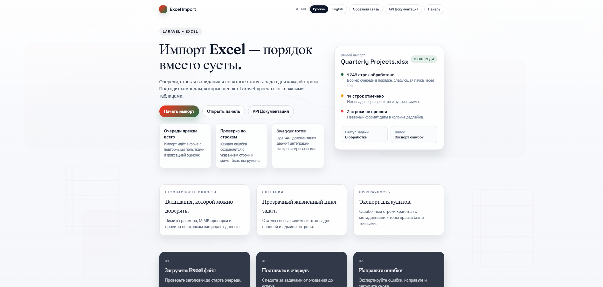

# Excel-import-Laravel

Laravel-приложение для импорта файлов XLSX/XLS/XLSM/CSV/TSV в базу данных с обработкой в очереди, отслеживанием ошибок и документацией API.

## Особенности
- Импорт файлов XLSX/XLS/XLSM/CSV/TSV с использованием динамических шаблонов и отслеживанием задач/статусов
- Мастер импорта: загрузка файла → предпросмотр → сопоставление колонок с полями шаблона → запуск импорта
- Умное сопоставление колонок и поддержка нескольких листов
- Обработчик очередей для длительных импортов
- Отслеживание неудачных строк для ошибок валидации
- Динамические шаблоны и столбцы, хранящиеся для каждого типа
- Админ‑панель для управления пользователями, типами, экспортом и данными БД
- Интерфейс на Inertia/Vue
- Документация Swagger/OpenAPI
- API-эндпоинты для задач, типов и шаблонов

## Требования
- PHP 8.2+
- Composer
- Node.js 18+ (рекомендуется 20+)
- MySQL 8+ (или другая поддерживаемая база данных)
- Расширения PHP: gd, zip, intl, pdo_mysql, pdo_sqlite

## Локальная настройка
1) Установите зависимости бэкенда:
* `composer install`
2) Установите зависимости фронтенда:
* `npm install`
3) Создайте файл окружения и сгенерируйте ключ:
* `cp .env.example .env`
* `php artisan key:generate`
* (опционально) Разрешить повторный запуск импорта для завершенных задач:
  * `IMPORT_ALLOW_RERUN_ON_SUCCESS=true`
4) Настройте БД в `.env` и запустите миграции:
* `php artisan migrate`
5) Если используется публичный диск, создайте символическую ссылку на хранилище:
* `php artisan storage:link`

## Запуск локально
* `php artisan serve`
* `npm run dev`
* `php artisan queue:work --queue=imports`
Открыть в браузере: `http://localhost:8000`

## Импорт данных
1) Загрузите файл на странице импорта.
2) В мастере импорта появится предпросмотр и автоматические подсказки сопоставления.
3) На шаге сопоставления выберите, какие колонки Excel соответствуют полям шаблона (обязательные поля подсвечены).
4) После запуска импорта статус и статистика (успешно/всего/ошибки) доступны в разделе задач.
Если файл содержит несколько листов, их названия сохраняются и будут использованы при экспорте в XLSX.

## Типы данных (админ)
Базовые типы задаются сидером `TypesSeeder` (текст, число, дата, булево, категория, финансы, контакты, enum‑статусы, ссылки, геоданные).
Расширять список можно в админке: `/admin/types`.

## Пользователи (админ)
Админка пользователей: `/admin/users`.

Доступно:
* создание пользователя по email и паролю;
* назначение/снятие роли администратора;
* блокировка и удаление пользователей.

## Админка данных
Универсальная страница для работы со всеми таблицами базы: `/admin/data`.

Возможности:
* просмотр и редактирование строк;
* создание/удаление записей;
* экспорт выбранных строк или отфильтрованных данных (XLSX/CSV/TSV);
* бэкап БД в `.sql` (MySQL) с опциональным архивом `storage`;
* очистка всех таблиц или выбранных.

## Чек-лист адаптивности
Используйте этот список при проверке интерфейса на десктопе/планшете/мобильных устройствах:
* Убедитесь, что таблицы сворачиваются в карточки на маленьких экранах (Проекты, Задачи, Неудачные строки, Шаблоны).
* Убедитесь, что кнопки действий располагаются друг над другом и остаются доступными для нажатия (импорт, экспорт, действия администратора).
* Проверьте видимость переключателя языков в шапке и мобильном меню.
* Подтвердите, что формы остаются в одну колонку на малой ширине, а поля ввода читаемы.

## Аутентификация
Регистрация включена. Поддерживается подтверждение электронной почты, но при локальной настройке пользователи по умолчанию помечаются как подтвержденные.

## Docker (Windows / Linux / macOS)
Проект оптимизирован для Docker. Он автоматически обрабатывает установку зависимостей, настройку окружения, миграции базы данных и заполнение данными.

1) Соберите и запустите контейнеры:
* `docker compose up --build -d`

Подождите несколько секунд, пока база данных инициализируется и точка входа завершит настройку (миграции, сиды).

2) Проверьте логи (опционально):
* `docker compose logs -f app`

3) Доступ к приложению:
* Бэкенд: `http://localhost:8000`
* Vite/Фронтенд: `http://localhost:5173`
* Mailhog: `http://localhost:8025`
* Документация Swagger API: `http://localhost:8000/api/documentation`

4) Запустите тесты внутри Docker:
* `docker compose exec app ./vendor/bin/phpunit`

Примечание: при изменении лимитов загрузки (например, размер файла) требуется пересборка контейнера `app` и `queue`.

5) Полезные команды Docker:
* Остановить: `docker compose stop`
* Удалить контейнеры: `docker compose down`
* Повторно заполнить демо-данными: `docker compose exec app php artisan db:seed --class=DemoDataSeeder`
* Отключить миграции/сиды для контейнера: `RUN_MIGRATIONS=false` / `RUN_SEEDERS=false`
* Разрешить повторный импорт успешных задач: `IMPORT_ALLOW_RERUN_ON_SUCCESS=true`

## Swagger / OpenAPI
Генерация документации:
* `php artisan l5-swagger:generate`
Открыть документацию:
* `/api/documentation`

## Интеграция API
Создайте токен для CRM или внешних сервисов:
* `php artisan user:token user@example.com`
* Дополнительные права: `php artisan user:token user@example.com sync --abilities=projects:import,projects:read`
* Срок действия (в днях): `php artisan user:token user@example.com sync --expires=30`

Основные эндпоинты (аутентификация с помощью токена Sanctum bearer):
* `GET /api/health`
* `GET /api/types`
* `GET /api/templates`
* `POST /api/projects/import`
* `GET /api/tasks`
* `GET /api/tasks/{task}/failed-rows`
* `GET /api/projects/{project}/export/{format}`
* `GET /api/tasks/{task}/export/{format}`
* `GET /api/types/{type}/export/{format}`

Важно: все API-эндпоинты требуют аутентификации и будут возвращать `403` для заблокированных пользователей (`is_blocked`).

## Обратная связь
Публичная форма обратной связи:
* `/feedback`

Панель администратора для отзывов (требуется пользователь-администратор):
* `/admin/feedback`

## Тесты
Запуск всех тестов:
* `./vendor/bin/phpunit`

Набор тестов настроен на использование SQLite в памяти через `phpunit.xml`.

## Сиды / Фикстуры
Заполнение базовых справочных данных:
* `php artisan db:seed`

Заполнение демо-данными (пользователь/проекты/задачи/неудачные строки):
* `php artisan db:seed --class=DemoDataSeeder`

Демо-пользователь:
* Email: `admin@example.com`
* Пароль: `password`

## Очередь
Очередь по умолчанию использует драйвер `database`:
* `php artisan queue:table`
* `php artisan migrate`
* `php artisan queue:work --queue=imports`

## Линтинг / Форматирование
* `./vendor/bin/pint`

## Поиск и устранение неисправностей
Если вы столкнулись с проблемами кэширования:
* `php artisan route:clear`
* `php artisan config:clear`
* `php artisan cache:clear`
* `php artisan optimize`

## Участие в разработке
Приветствуются пулл-реквесты (PR) и сообщения об ошибках. Пожалуйста, добавляйте тесты для нового функционала.

## Лицензия
MIT
